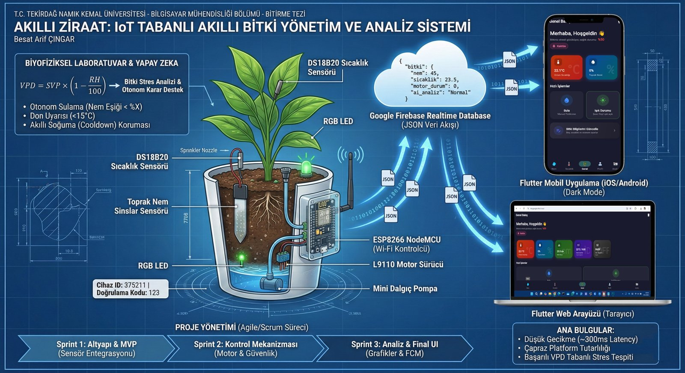

# 🌱 Akıllı Ziraat
### IoT-Based Smart Plant Management & Analysis System

**Tekirdağ Namık Kemal Üniversitesi — Bilgisayar Mühendisliği Bölümü — Bitirme Tezi**
**Besat Arif ÇINGAR** · Advisor: Dr. Öğr. Üyesi Halil Nusret BULUŞ

---

## 🎬 Demo

**[▶ Watch on YouTube](https://youtube.com/shorts/pfoTzipqWHc)**

---

## 🌍 Choose your language / Dil seçin

|                                       |                                       |
|:-------------------------------------:|:-------------------------------------:|
| [**🇬🇧 English**](docs/README.en.md) | [**🇹🇷 Türkçe**](docs/README.tr.md) |
| Full documentation in English          | Tam dokümantasyon Türkçe olarak       |

---

An autonomous, real-time, biophysics-aware plant-care system built end-to-end
(hardware → cloud → cross-platform app) as a solo undergraduate thesis project.

