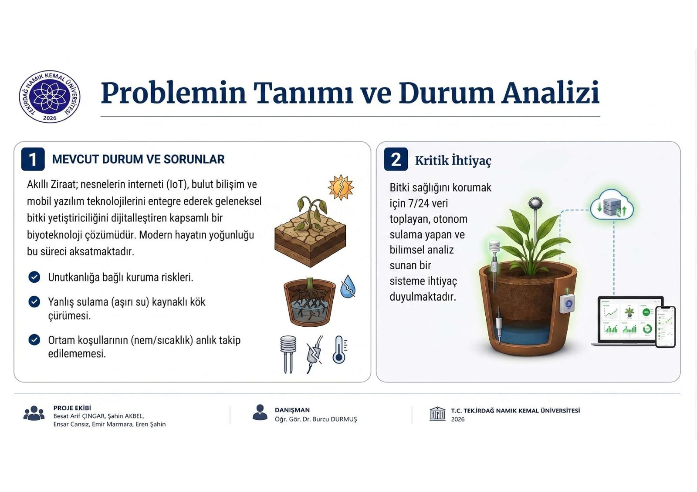
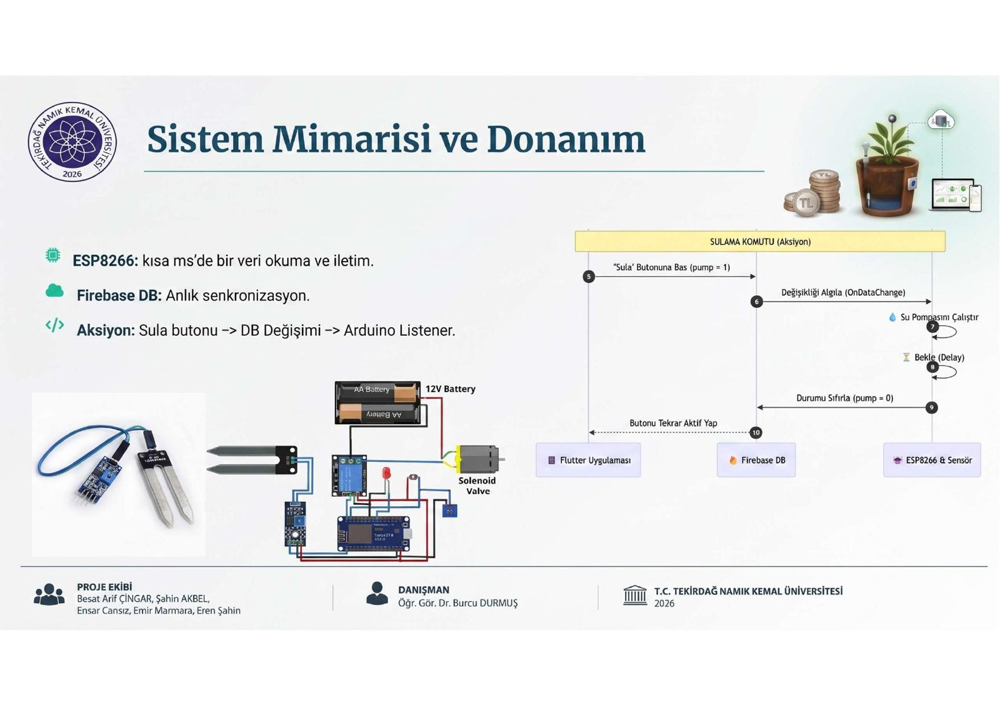
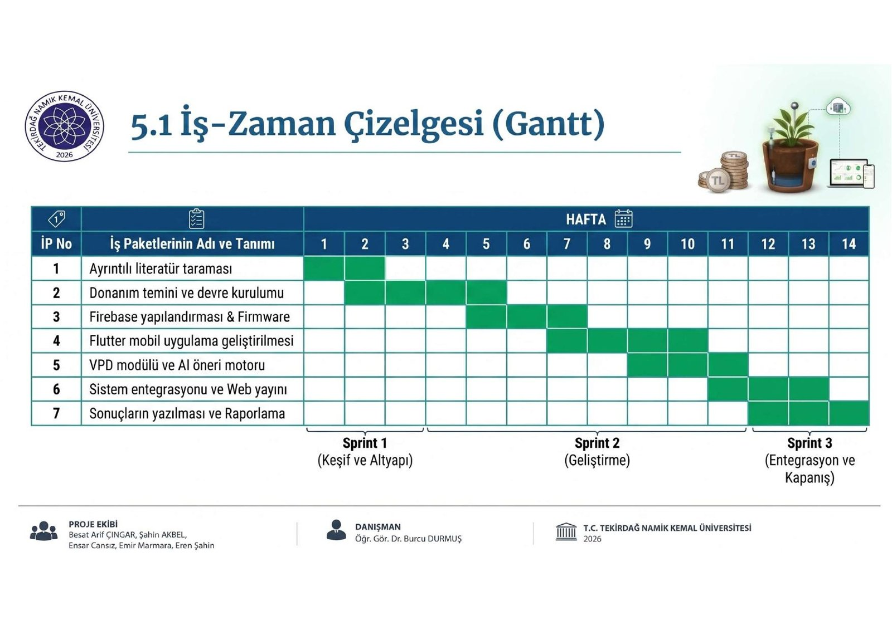
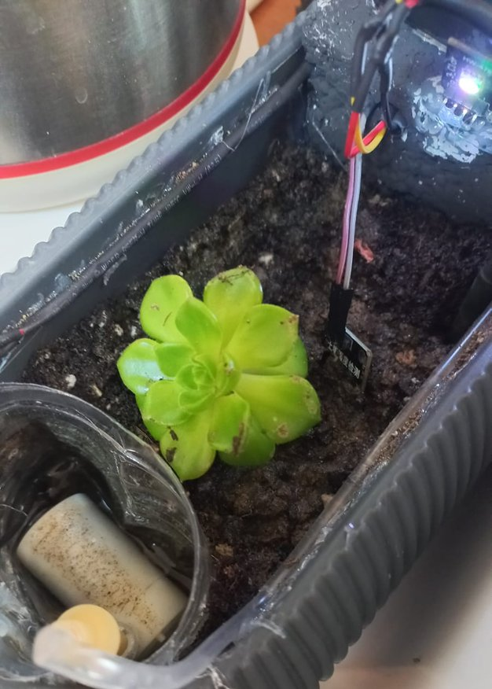
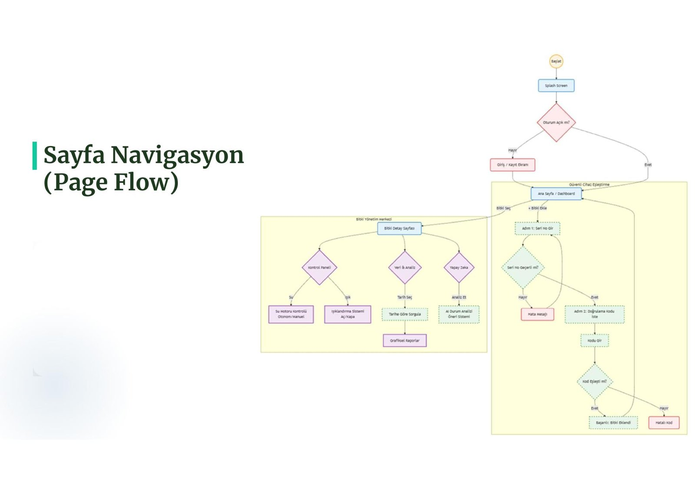
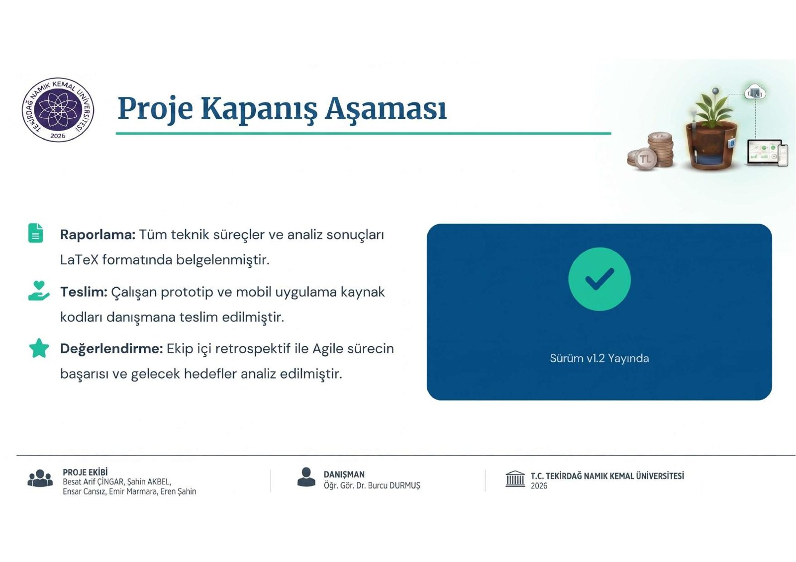
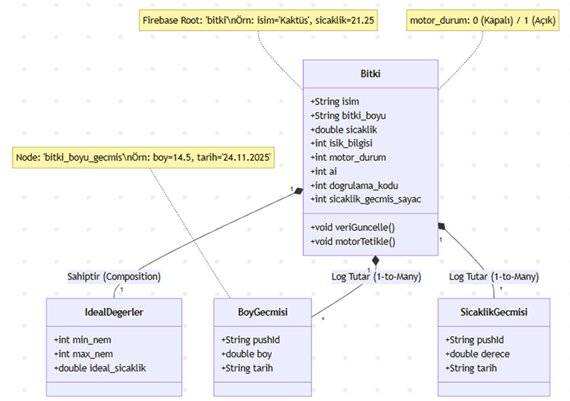
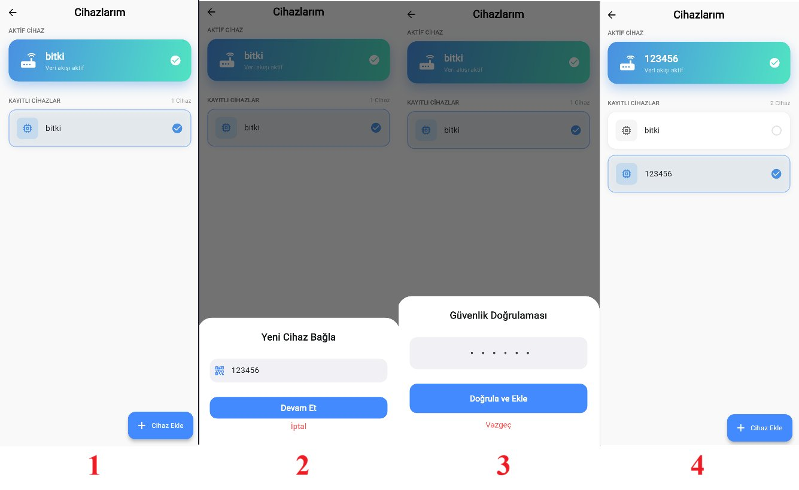
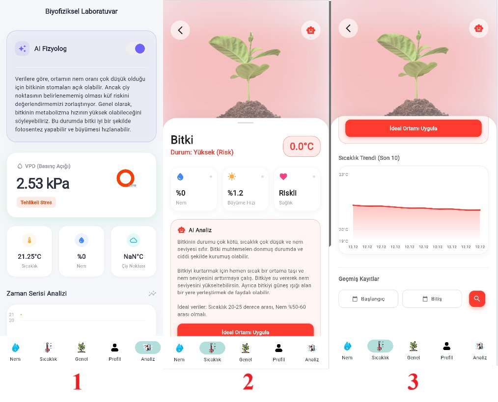
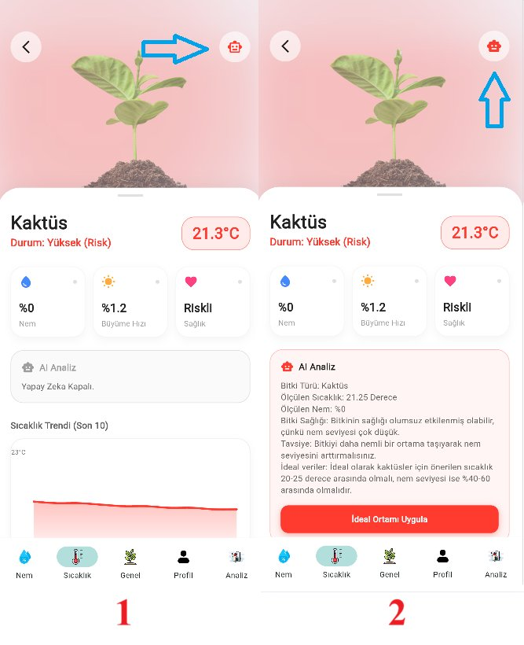

<div align="center">


# 🌱 Akıllı Ziraat
### IoT Tabanlı Akıllı Bitki Yönetim ve Analiz Sistemi

[**🇬🇧 Read this page in English**](README.en.md) · [⬅ Ana sayfaya dön](../README.md)

</div>

---

## İçindekiler

- [Proje Hakkında](#proje-hakkında)
- [Neden](#neden)
- [Öne Çıkan Özellikler](#öne-çıkan-özellikler)
- [Sistem Mimarisi](#sistem-mimarisi)
- [Donanım](#donanım)
- [Biyofiziksel Laboratuvar (VPD)](#biyofiziksel-laboratuvar-vpd)
- [Uygulama Görselleri](#uygulama-görselleri)
- [Teknoloji Yığını](#teknoloji-yığını)
- [Depo Yapısı](#depo-yapısı)
- [Başlarken](#başlarken)
- [Sonuçlar](#sonuçlar)
- [Yol Haritası](#yol-haritası)
- [Yazar ve Teşekkür](#yazar-ve-teşekkür)
- [Lisans](#lisans)

---

## Proje Hakkında

**Akıllı Ziraat**, bir ev bitkisinin bakımını, sahibinin hatırlamasına
gerek kalmadan üstlenen uçtan uca bir IoT sistemidir. ESP8266 tabanlı
akıllı saksı; toprak nemini ve ortam sıcaklığını sürekli ölçer, verileri
gerçek zamanlı olarak Firebase'e aktarır ve gerektiğinde bitkiyi
otonom olarak sular. Flutter ile geliştirilen çapraz platform uygulama
(Android / iOS / Web) sayesinde kullanıcı, bitkisini izleyebilir,
kontrol edebilir ve **Buhar Basıncı Açığı (VPD)** hesabına dayanan
**biyofiziksel stres analizini** görebilir.

Bu proje; donanım, bulut şeması, mobil/web arayüz, biyofiziksel
matematik modelleme ve tez yazımı dahil olmak üzere uçtan uca
**tek kişi tarafından** tasarlanmış ve geliştirilmiştir. **Tekirdağ
Namık Kemal Üniversitesi** Bilgisayar Mühendisliği Bölümü bitirme
projesi olarak, **Dr. Öğr. Üyesi Halil Nusret BULUŞ** danışmanlığında
yürütülmüştür. Proje yönetimi (backlog, 3 Agile sprint, RACI matrisi,
Gantt şeması) da yine tek kişilik olarak, standart Scrum araçları
kullanılarak 14 haftalık bir sürece yapılandırılmıştır.

> 📄 Tezin tam metni (Türkçe) referans amacıyla [`/docs/thesis`](thesis)
> klasöründe, sunum dosyasıyla birlikte yer almaktadır.

## Neden

Modern hayatın temposu, insanları ev içi bitkilerin ihtiyaç duyduğu
günlük dikkatten uzaklaştırıyor. En yaygın iki bitki kaybı sebebi
aslında tamamen önlenebilir:

1. **İhmal** — sulamayı unutmak, bitkinin kurumasına yol açar.
2. **Aşırı sulama** — "ihtiyaten" sulamak, kök çürümesine yol açar.

Akıllı Ziraat, tahmine dayalı bakımın yerine sürekli sensör verisi,
yapılandırılabilir hedef aralıklar ve bitkinin o an ne kadar strese
girdiğine dair bilimsel bir ölçüm koyar — sadece toprağın "ıslak mı
kuru mu" olduğuna değil.

## Öne Çıkan Özellikler

- 🔄 **Gerçek zamanlı izleme** — toprak nemi ve sıcaklık, Firebase
  Realtime Database üzerinden ~250–400 ms gecikmeyle uygulamaya akar.
- 💧 **Otonom sulama** — histerezis + soğuma (cooldown) süresi tabanlı
  algoritma, hem susuz kalmayı hem de aşırı sulamayı önler, röleyi
  ardışık açılıp kapanmadan korur.
- 🧪 **Biyofiziksel Laboratuvar** — anlık sıcaklık/nem verisinden
  **Buhar Basıncı Açığı (VPD)** ve çiy noktasını hesaplayarak bitkinin
  terleme stresini ham sensör değerinden daha anlamlı biçimde ortaya
  koyar.
- 🤖 **Yapay zeka destekli yorumlama** — kural tabanlı motor ve Gemini
  entegrasyonu, sensör + VPD verisini anlaşılır önerilere dönüştürür
  ("bitkiniz çok hızlı su kaybediyor, doğrudan ışıktan uzaklaştırın").
- 📱 **Çapraz platform uygulama** — tek bir Flutter kod tabanı;
  Android, iOS ve Web'e, açık/koyu tema desteğiyle derlenir.
- 🔐 **Güvenli cihaz eşleştirme** — bir saksının hesaba bağlanabilmesi
  için Cihaz ID + doğrulama kodundan oluşan iki aşamalı (2FA benzeri)
  akış.
- 📈 **Geçmiş kayıtlar ve grafikler** — zaman damgalı sıcaklık/nem
  geçmişi, `fl_chart` ile görselleştirilir.
- 🔔 **Push bildirimleri** — kritik eşiklerde (örn. 15 °C altı don
  riski) Firebase Cloud Messaging ile anlık uyarı.

## Sistem Mimarisi

<div align="center">

</div>

Platform, aynı bulut/uygulama altyapısını paylaşan iki dağıtım
senaryosu için kapsamlandırılmıştır: tarla ölçekli sensör ağı ve bu
tez kapsamında tam olarak hayata geçirilen ev içi akıllı saksı
varyantı.

<div align="center">
<br/>
<sub>Sensörler (ESP8266) → Firebase Realtime DB → Flutter uygulaması, <code>StreamBuilder</code> ile 250–400 ms'de senkronize edilir.</sub>
</div>

<div align="center">

<br/><sub>Uçtan uca komut yolu: uygulamada "Sula" butonuna basmak Firebase'deki bir bayrağı çevirir,
ESP8266 dinleyicisi değişikliği yakalar (<code>onDataChange</code>), pompayı tetikler, sonra bayrağı sıfırlar.</sub>
</div>

## Donanım

<div align="center">

</div>

| Bileşen | Görev |
|---|---|
| **ESP8266 NodeMCU** | Merkezi kontrolcü, Wi-Fi |
| **DS18B20** | Su geçirmez dijital sıcaklık sensörü (±0.5 °C) |
| **Analog toprak nem sensörü** | Korozyona dayanıklı, toprağa gömülü prob |
| **L9110** | Çift kanal DC motor sürücü |
| **Mini dalgıç pompa** | 120 L/H |
| **RGB LED** | Uzaktan kontrol edilebilir ortam durum ışığı |

Tam malzeme listesi ve maliyet dökümü tez ekinde yer almaktadır
(prototip başına ≈ 455 TL).

## Biyofiziksel Laboratuvar (VPD)

Sistemin en özgün kısmı: sadece "%40 nem" göstermek yerine,
yetiştiricilerin terleme stresini değerlendirmek için gerçekten
kullandığı metrik olan **Buhar Basıncı Açığı**'nı hesaplar:

```
SVP  = 0.6108 × exp( 17.27 × T / (T + 237.3) )
VPD  = SVP × (1 − RH / 100)
```

Burada `T` sıcaklık (°C), `RH` ise bağıl nemdir (%). Yüksek VPD,
havanın bitkiden kökten karşılanabilecek hızdan daha fazla nem
"çektiği" anlamına gelir — uygulama bunu ham bir kPa değeri yerine
anlaşılır bir stres uyarısı olarak sunar.

<div align="center">

</div>

## Uygulama Görselleri

<div align="center">



</div>
<div align="center">


</div>

## Teknoloji Yığını

| Katman | Teknoloji |
|---|---|
| Mikrodenetleyici | ESP8266 (NodeMCU), Arduino çatısı |
| Sensörler | DS18B20, analog kapasitif/resistif toprak probu |
| Bulut | Google Firebase (Realtime Database, Cloud Messaging) |
| Mobil / Web | Flutter, Dart (tek kod tabanı → Android / iOS / Web) |
| Grafikler | `fl_chart` |
| Yapay Zeka | Kural tabanlı yorumlayıcı + `google_generative_ai` (Gemini) |
| Cihaz eşleştirme | `mobile_scanner` (QR) + sayısal doğrulama kodu |
| Proje yönetimi | Agile / Scrum — 3 sprint, RACI matrisi, Gantt şeması |

## Depo Yapısı

```
.
├── README.md                  # Buradasınız (dil seçici)
├── docs/
│   ├── README.en.md           # İngilizce dokümantasyon
│   ├── README.tr.md           # Bu belge
│   └── thesis/                # Tam tez PDF'i + savunma sunumu
├── firmware/
│   ├── README.md               # Gömülü yazılım mimarisi notları
│   └── examples/                # Gizlenmiş örnek sketch + config şablonu
├── mobile/
│   ├── README.md               # Uygulama mimarisi notları
│   └── lib_structure/           # Gizlenmiş örnek model dosyaları
└── assets/
    ├── images/                  # Banner / kapak görseli
    ├── diagrams/                 # Mimari ve akış diyagramları
    ├── screenshots/               # Uygulama arayüzü ekran görüntüleri
    └── hardware/                   # Fiziksel prototip fotoğrafları
```

## Başlarken

> ⚠️ **Bu depo bir portföy / dokümantasyon deposudur, klonlayıp
> doğrudan çalıştırabileceğiniz bir uygulama değildir.** Burada
> paylaşılan gömülü yazılım ve Flutter kaynakları bilinçli olarak
> **gizlenmiş (redacted) örneklerdir** — gerçek mimariyi ve dosya
> yapısını gösterirler, ancak ayarlanmış eşik değerleri, kalibrasyon
> sabitleri, tam yapay zeka istem (prompt) hattı ve Firebase
> kimlik bilgileri kaldırılmış ya da yer tutucularla değiştirilmiştir.
> Bu, tez çalışmasının doğrudan GitHub üzerinden kopyalanıp yeniden
> dağıtılmasını engellerken, incelemek isteyen jüri, danışman veya
> işverenlerin mimariyi görebilmesini sağlar.
>
> **Akademik değerlendirme için tam kaynak kodu mu istiyorsunuz?**
> [Yazar ve Teşekkür](#yazar-ve-teşekkür) bölümünden iletişime geçin.

Yalnızca mimariyi incelemek isterseniz:

1. ESP8266 tarafı için (pin haritası, veri döngüsü, Firebase JSON
   yapısı) [`firmware/README.md`](../firmware/README.md) dosyasını
   okuyun.
2. Flutter uygulaması için (modül yapısı, temel paketler, özellik
   listesi) [`mobile/README.md`](../mobile/README.md) dosyasını okuyun.
3. Tüm formülleri, sprint raporlarını ve deneysel sonuçları içeren tam
   metin için [`docs/thesis`](thesis) klasörüne göz atın.

## Sonuçlar

Gerçek koşullarda yapılan testlerde ölçülen değerler (ayrıntılar için
tezin §7.1 bölümüne bakınız):

- **Komut gecikmesi**: Uygulamada "Sula" butonuna basıldıktan pompanın
  çalışmasına kadar, Firebase'in WebSocket tabanlı senkronizasyonu
  sayesinde 250–400 ms.
- **Otomatik yeniden bağlanma**: ESP8266, Wi-Fi kopmalarını algılayıp
  kendiliğinden yeniden bağlanır; veri akışı, kesinti süresi dışında
  aksamaz.
- **Salınım önleme**: 8 birimlik histerezis marjı ve `millis()` tabanlı
  soğuma süresi, ilk testlerde gözlemlenen pompanın ardışık açılıp
  kapanma sorununu ortadan kaldırmıştır.
- **Çapraz platform tutarlılığı**: aynı Flutter kod tabanı, görsel
  olarak tutarlı Android APK ve Web çıktıları üretmiştir.

## Yol Haritası

- 📷 Yaprak hastalığı tespiti (pas, küf vb.) için ESP32-CAM ve derin
  öğrenme entegrasyonu.
- ☀️ Saha kullanımlarında enerji bağımsızlığı için güneş paneli
  desteği.
- 📡 Wi-Fi kapsama alanı dışındaki tarımsal kullanımlar için LoRaWAN
  desteği.

## Yazar ve Teşekkür

**Besat Arif ÇINGAR** — Bilgisayar Mühendisliği, Tekirdağ Namık Kemal
Üniversitesi ().

Bu proje; tasarım, donanım, gömülü yazılım, bulut şeması, mobil/web
uygulama, biyofiziksel modelleme ve yazım dahil olmak üzere tek kişi
tarafından hazırlanmış bir lisans bitirme tezidir. Süreç boyunca
verdiği destek için danışmanım **Dr. Öğr. Üyesi Halil Nusret BULUŞ**'a
içtenlikle teşekkür ederim.

Tam kaynak koduyla, bir demo ile veya uygulama detaylarıyla ilgili
sorularınız mı var? Bu depoda bir issue açabilir ya da doğrudan
benimle iletişime geçebilirsiniz.

## Lisans

Bu depodaki dokümantasyon, diyagramlar ve gizlenmiş örnek dosyalar
[MIT Lisansı](../LICENSE) ile yayımlanmıştır. Üretim seviyesindeki tam
gömülü yazılım ve mobil uygulama kaynak kodu bu genel (public) depoya
**dahil değildir** (bkz. [Başlarken](#başlarken)).
